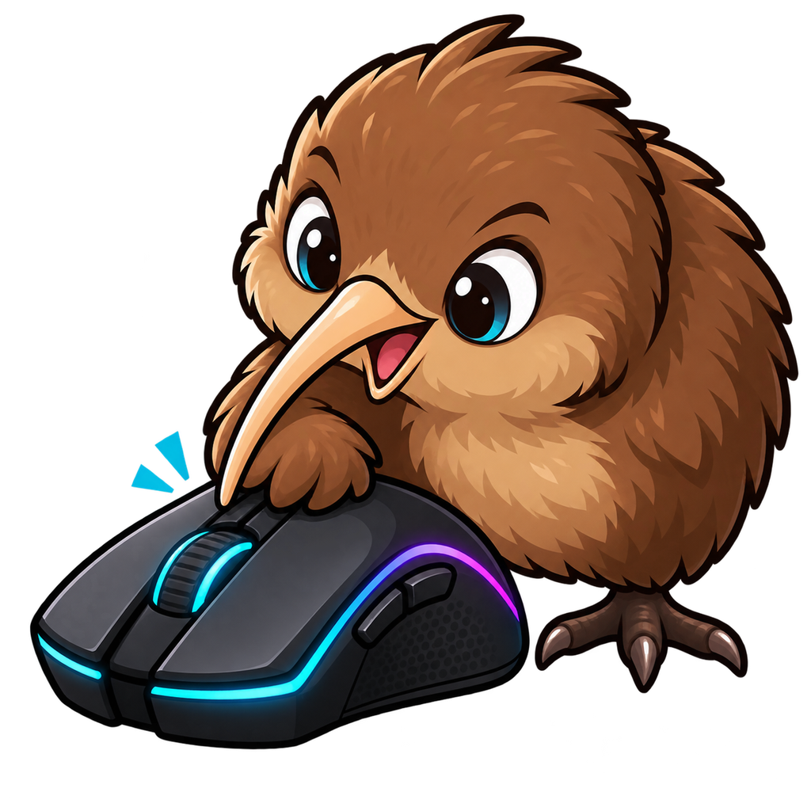

# MouseJiggle

<p align="center">
  
</p>

A small, portable Windows mouse jiggler with Normal and Zen modes, a notification-area menu, light/dark themes, and optional startup with Windows.

輕量、免安裝的 Windows 滑鼠防閒置工具，提供 Normal／Zen 模式、系統匣選單、淺色／深色介面及選用的開機啟動。

## 下載｜Download

- [直接下載 EXE｜Download EXE](https://github.com/xyzKIWI/MouseJiggle/releases/latest/download/MouseJiggle.exe)
- [下載可攜版 ZIP｜Download portable ZIP](https://github.com/xyzKIWI/MouseJiggle/releases/latest/download/MouseJiggle.zip)
- [GitHub Releases](https://github.com/xyzKIWI/MouseJiggle/releases/latest)

Windows 10／11，需具備 .NET Framework 4.8。程式以 x86 WinExe 編譯，不需安裝或系統管理員權限。

Windows 10/11 with .NET Framework 4.8 is required. The application is compiled as an x86 WinExe and requires neither installation nor administrator privileges.

---

## 繁體中文

### 功能

- 開啟後立即開始，預設為 Zen 模式、每 50 秒送出一次滑鼠輸入。
- **Zen**：使用 `SendInput(0,0)`，防止閒置但不移動游標。
- **Normal**：游標每次以 ±4 px 來回移動。
- 間隔可設為 1–60 秒；變更模式或秒數會立即生效。
- 深色／淺色視窗模式。
- 支援系統匣操作：Start/Stop、Normal/Zen、顯示視窗及退出。
- 按右上角 `X` 或 `Alt+F4` 只會縮到系統匣；請使用視窗或托盤選單的 **Exit** 真正結束程式。
- 第二次啟動不會產生重複程序，而會喚回已執行的視窗。
- Kiwi bird＋黑色 RGB 電競滑鼠多尺寸 icon。

### 使用方式

1. 下載 `MouseJiggle.exe`，或解壓縮 `MouseJiggle.zip`。
2. 執行 `MouseJiggle.exe`；程式會立即以 Zen 模式開始。
3. 使用 **Start Jiggling／Stop Jiggling** 控制執行狀態。
4. 選擇 **Normal** 或 **Zen**，並設定 1–60 秒間隔。
5. 勾選 **Start with Windows (minimized)** 後，Windows 登入時會自動以 `--minimized` 啟動並留在系統匣。此設定只寫入目前帳號的 `HKCU\Software\Microsoft\Windows\CurrentVersion\Run`，不需要管理員權限；取消勾選即可移除。

若移動 EXE，請重新設定開機啟動，讓登錄項目指向新的位置。

### 可攜設定

程式會在 EXE 旁讀寫 `MouseJiggle.ini`，保存以下項目：

- `Mode=Zen` 或 `Mode=Normal`
- `IntervalSeconds=1` 至 `60`
- `Theme=Dark` 或 `Theme=Light`

缺少或設定無效時會回到 Zen、50 秒及深色模式。唯讀資料夾中仍可執行，但無法保存變更。

### 命令列

```text
-j, --jiggle       啟動後立即執行（本來就是預設值）
-z, --zen          使用 Zen 模式
-m, --minimized    啟動後縮到系統匣
-s:X, --seconds:X  設定 1–60 秒間隔
-h, --help         顯示說明
```

### 隱私與安全

MouseJiggle 不使用網路、不安裝服務、不記錄鍵盤或滑鼠內容、不建立全域 hook，也不要求提升權限。它只依設定的時間間隔呼叫 Windows `SendInput`。請遵守組織的資訊安全與電腦使用政策。

---

## English

### Features

- Starts jiggling immediately; defaults to Zen mode with a 50-second interval.
- **Zen:** calls `SendInput(0,0)` to prevent idle state without moving the pointer.
- **Normal:** moves the pointer back and forth by ±4 pixels.
- Adjustable 1–60 second interval; mode and interval changes apply immediately.
- Dark and light window themes.
- Notification-area menu for Start/Stop, Normal/Zen, Show Window, and Exit.
- The title-bar `X` and `Alt+F4` minimize to the notification area. Use **Exit** in the window or tray menu to terminate the application.
- A second launch restores the existing instance instead of starting another process.
- Multi-size kiwi bird and black RGB gaming mouse icon.

### Usage

1. Download `MouseJiggle.exe`, or extract `MouseJiggle.zip`.
2. Run `MouseJiggle.exe`; it starts immediately in Zen mode.
3. Use **Start Jiggling / Stop Jiggling** to control the active state.
4. Select **Normal** or **Zen**, then choose an interval from 1 to 60 seconds.
5. Enable **Start with Windows (minimized)** to launch with `--minimized` after sign-in. This creates only a current-user entry under `HKCU\Software\Microsoft\Windows\CurrentVersion\Run`; no administrator rights are required. Clear the checkbox to remove it.

If you move the EXE, disable and re-enable startup so the registry entry points to the new location.

### Portable settings

`MouseJiggle.ini` is read from and written beside the EXE. It stores:

- `Mode=Zen` or `Mode=Normal`
- `IntervalSeconds=1` through `60`
- `Theme=Dark` or `Theme=Light`

Missing or invalid settings fall back to Zen, 50 seconds, and the dark theme. The application still runs from a read-only folder, but setting changes cannot be saved there.

### Command line

```text
-j, --jiggle       Start jiggling (already the default)
-z, --zen          Use Zen mode
-m, --minimized    Start in the notification area
-s:X, --seconds:X  Set a 1–60 second interval
-h, --help         Show help
```

### Privacy and safety

MouseJiggle does not use the network, install a service, record keyboard or mouse content, create global hooks, or request elevation. It only calls Windows `SendInput` at the selected interval. Use it in accordance with your organization's security and acceptable-use policies.

## Build and test

From Windows PowerShell:

```powershell
.\build.ps1
.\test.ps1
```

The release executable is written to `bin\Release\MouseJiggle.exe`. The build uses the .NET Framework 4.x C# compiler included with Windows and targets .NET Framework 4.8.

## Attribution and license

This is an unofficial custom build based on **Mouse Jiggler 1.8.42 by Arkane Systems**. It is not an official Arkane Systems release. Original and modified source code are distributed under the [Microsoft Public License (Ms-PL)](LICENSE); attribution notices have been retained.

這是基於 **Arkane Systems Mouse Jiggler 1.8.42** 的非官方自訂版本，並非 Arkane Systems 官方發行。原始與修改後的程式碼均依 [Microsoft Public License（Ms-PL）](LICENSE) 發布，且保留原作者歸屬。
